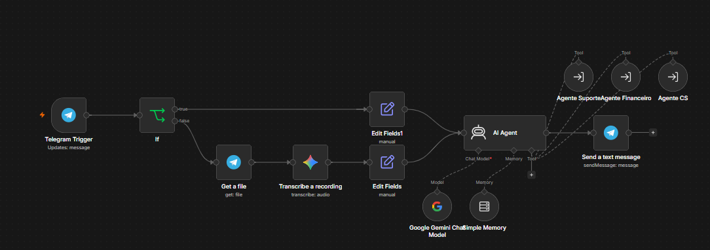

# Hashtag Capital — Atendimento Multi-Agente (n8n)

Sistema de atendimento automatizado via **Telegram**, construído no n8n com uma arquitetura **multi-agente**: um agente gerente classifica a intenção do cliente e roteia a conversa para sub-agentes especialistas, cada um com seu próprio prompt, memória e ferramentas.

## 🖼️ Visualização do fluxo



## 🧠 Arquitetura

```
Telegram (texto ou áudio)
        │
        ▼
  [If: existe texto?] ──► não ──► transcreve áudio (Gemini) ──┐
        │ sim                                                  │
        ▼                                                      ▼
                    Sofia — Agente Gerente (orquestrador)
                    (classifica a intenção e chama a tool certa)
                                    │
        ┌───────────────────────────┼───────────────────────────┐
        ▼                           ▼                           ▼
  Agente Suporte              Agente Financeiro             Agente CS
   (Leo)                        (Bia)                   (Sucesso do Cliente)
```

Cada especialista é um **sub-workflow separado**, chamado pela Sofia como uma *tool* (via `toolWorkflow`). A Sofia atua como "roteador invisível": nunca responde por conta própria, apenas repassa a resposta do especialista ao cliente.

## 🤖 Agentes

### Sofia — Gerente de Atendimento (`Agente_gerente.json`)
- Recebe mensagens de texto ou áudio via Telegram
- Se for áudio, transcreve com Gemini antes de processar
- Classifica a intenção do cliente e aciona o sub-agente correspondente
- Mantém memória de conversa por `ChatID` (janela de 40 mensagens)
- Trata o sinal `##RESET##`: se um sub-agente não conseguir resolver, a Sofia assume e pede mais detalhes ao cliente

### Bia — Agente Financeiro (`SubAgente_Financeiro.json`)
- Atende dúvidas sobre pagamentos, boletos e 2ª via
- Consulta o status do cliente numa planilha do Google Sheets (por e-mail)
- Responde de forma diferente conforme o status: sem pendências, pendente, ou pedido de 2ª via

### Leo — Agente de Suporte a Dúvidas (`Subagente_Suporte_a_Duvidas.json`)
- Tira dúvidas conceituais sobre produtos financeiros (CDB, Ações, FIIs, Tesouro, Selic etc.)
- Caráter educativo — **não** faz recomendação de compra
- Direciona para o assessor quando o cliente pede indicação personalizada

### Arthur — Agente CS / Sucesso do Cliente (`Sub_Agente_Sucesso_Cliente.json`)
- Cuida de relacionamento, qualificação e agendamento de reuniões com o assessor sênior
- Fluxo em duas fases: primeiro faz uma triagem rápida (ex: "proteção de patrimônio ou rentabilidade?"), depois coleta data, hora, nome e e-mail
- Agenda o compromisso direto no **Google Calendar**, já com link de videochamada (Google Meet) e convite enviado ao cliente

## 🔌 Integrações utilizadas

- **Telegram** (trigger de mensagens e envio de respostas, incluindo áudio)
- **Google Gemini** (modelo de linguagem `gemini-3.5-flash-lite` + transcrição de áudio)
- **Google Sheets** (consulta de status financeiro do cliente)
- **Google Calendar** (agendamento automático de reuniões com videochamada)
- **n8n Sub-workflows** (arquitetura de agentes via `toolWorkflow`)

## 📦 Como importar

1. Crie os 4 workflows no n8n (um para cada `.json` deste repositório)
2. Importe cada um em **Settings → Import from File**
3. No workflow "Agente gerente", atualize as referências de `workflowId` de cada tool (Agente Suporte, Agente Financeiro, Agente CS) para apontar aos IDs gerados na sua instância
4. Configure suas próprias credenciais:
   - Telegram Bot API
   - Google Gemini (PaLM) API
   - Google Sheets OAuth2
  - Google Calendar OAuth2
5. Ative o workflow "Agente gerente" (é o único com trigger)

## ⚙️ Pré-requisitos

- Instância do n8n (cloud ou self-hosted)
- Bot do Telegram configurado
- Chave de API do Google Gemini
- Planilha do Google Sheets com colunas de status financeiro por cliente

## 📝 Observações

- Projeto criado para fins de estudo/portfólio, simulando o atendimento de uma assessoria de investimentos fictícia (Hashtag Capital)
- Os `.json` exportados não contêm credenciais — é necessário configurar as suas próprias após a importação
- O `.json` do Arthur (Sucesso do Cliente) tem um e-mail pessoal fixo no campo do Google Calendar (`calendar`) — vale trocar por um placeholder tipo `seu-email@gmail.com` antes de deixar o repositório público
